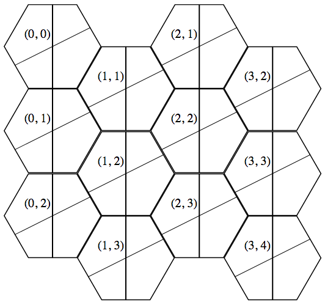

# `hex-automata`

_A [d3.js](https://d3js.org/) based framework for implementing hexagonal cellular automatons_

### Introduction

This Javascript library implements two classes: `Hex` and `HexMap`. `HexMap` is a container for `Hex` instances.

### Features

- Extensible `Hex` base class
- Hexagonal coordinate system
- Clickable hexagon interiors and edges
- Cell neighbor determination
- State JSON dumping and loading

### Hexagon Coordinate System

This library implements a skewed screen cartesian coordinate system. Here is an example:



Some methods will return offsets to indicate a relative direction. These offsets may be used to indicate an edge of the current hexagon or a neighboring hexagon. Offsets will be in a _(dx, dy)_ format. For example, if _dx_ is -1 and _dy_ is 0, this offset indicates a direction to the left and below the current hex.

### Initializing a `HexMap`

In your HTML, create an `<svg>` element. In your relevant `<script>` tag, create a new `HexMap` object and pass a selector to the constructor as the first parameter. This must happen _after_ the `<svg>` element has loaded. For example:

```
<body>
	<svg id="mySvg"></svg>
	<script>
		var map = new HexMap("#mySvg");
		map.buildRect(4, 3);
	</script>
</body>
```

### Subclassing `Hex`

You may subclass `Hex` and dump or load JSON data that refers to subclass hexes. To create a `Hex` subclass, you must:

- Create a class that extends `Hex`
- Override the `constructor(json)` method that calls the base class constructor and loads any additional properties
- Override the `dump()` method of the `Hex` class
- Provide constructors when initializing the HexMap
- Optionally, you may specify this subclass as the default class to build new topologies

```
<script>
	class ConwayHex extends Hex {
		constructor(json) {
			super(json);
			this.alive = false;
			if (json) {
				this.alive = json.alive;
			}
		}
		
		dump() {
			var result = super.dump();
			result.alive = this.alive;
			return result;
		}
	}
	
	var map = new HexMap("#mySvg", { constructors : { "ConwayHex" : ConwayHex } });
	map.hex = ConwayHex;
	map.buildRect(4, 3);
</script>
```

### Iterating to the Next Generation of an Automaton

To create an automaton that generates new states, you must:

- Override the `next(neighbors)` function of the `Hex` class, where the `neighbors` parameter will be an array of neighboring hexes _(ex: `[ { dx : 0, dy : 1, hex : Object } ]`)_. This method must generate a new `Hex` instance or subclass instance that represents the cell occupying the same space in the next object.
- Call the `next()` method on the `HexMap`
- Optionally, load the object returned by `next()` using the `fromJson()` function

```
<script>
	class ConwayHex extends Hex {
	...
		next(neighbors) {
			var neighbors = 0;
			for (var i in neighbors) {
				if (neighbors[i].hex.alive) neighbors++;
			}
			if (neighbors <= lonely || neighbors >= crowded) {
				return new ConwayHex({ alive : false });
			} else {
				return new ConwayHex({ alive : true });
			}
		}
	}
	
	var map = new HexMap( ... );
	...
	var result = map.next();
	map.fromJson(result);
</script>
```

### Full Documentation

Additional [documentation](./REFERENCE.md) on this API is available.